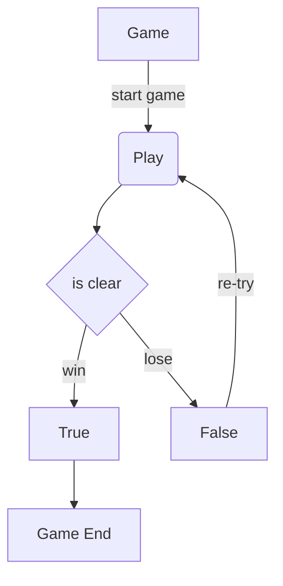
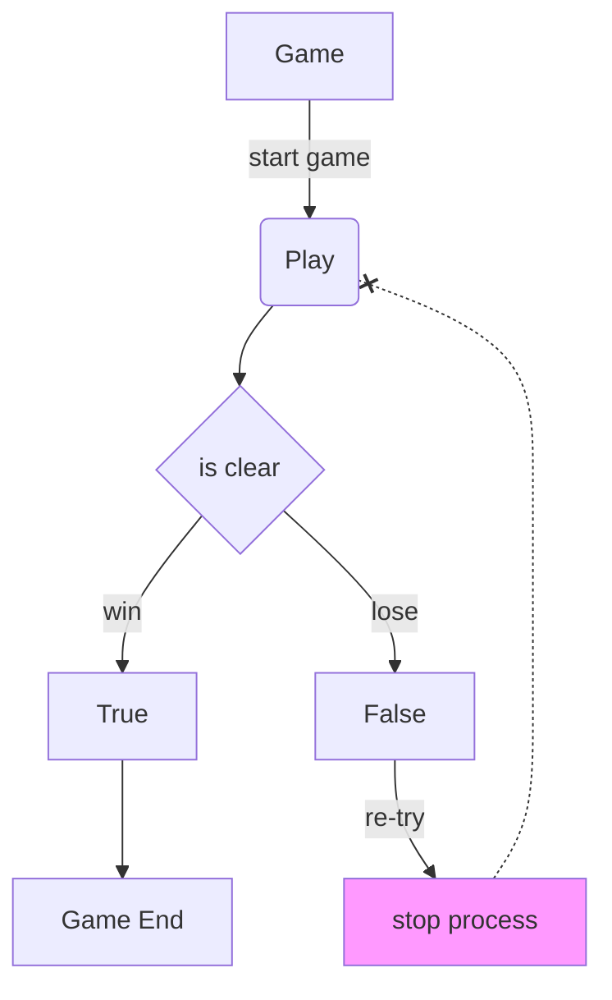

최근 이직을 준비하면서 가지고 있는 기술 스택에 비해 제작했던 프로젝트가 모두 스프링 부트 또는 파이썬 프로젝트인 것을 알았습니다. 담당자의 입장에서는 아이러니 할 수 도 있을 것 같아 `Node(이하 노드)`계열의 기술로 새 프로젝트를 제작하고 있지요.

제작하면서 발생하는 에러 상황이나 어려운 문제를 직면하게 되는데요. 그 중에서도 예외처리에 많은 신경을 기울입니다. `try-catch`는 익숙하면서도 "왜 이렇게 동작하지?"할 때가 있습니다. 바쁘다는 핑계로 정리를 미루다가 이번에 다루어 봅니다.

# try-catch, 왜 필요한가?

예외처리는 프로그램이 실행 중에 문제가 발생했을 때 처리한다는 개념입니다. 문제가 발생하면 프로그램은 멈추거나 이후의 프로세스가 실행되지 않습니다.

간단한 예시를 들자면, 다음과 같은 순서로 프로그램이 동작한다고 가정하겠습니다.



위와 같은 과정으로 게임이 실행될 때 만약 게임에 실패하고 다시 플레이 하는 과정에서 에러가 발생했다고 가정한다면, `Play`하는 부분에서 실행이 멈추고 동작하지 않습니다.

`re-try` 과정에서 에러가 발생한다면 `Play`까지 가지도 못하고 실행이 멈추게 됩니다. 게임을 진행하는데 에러가 발생하고 완전 동작이 멈춘다면 사용자 입장에서는 최악이 됩니다.

종료라도 누르고 싶지만 프로그램 자체가 멈췄기 때문에 강제로 종료하는 방법 밖에 없습니다.



프로그램에서 예외가 발생하는 부분은 항상 처리해주는 것이 좋다고 생각합니다. 특히나 비동기를 다룰 때는 무조건 예외처리를 해주는 것을 권장합니다. 아무리 정확하게 원하는 결과가 나오는 함수더라도 예외처리는 필수입니다.

간혹 깃허브로 남의 소스코드를 염탐하다 보면 예외처리를 아예 안하거나, 드문드문 중요하다고 생각되는 곳에 예외처리를 하는 분을 종종 봤습니다.

예외처리는 에러가 발생하더라도 후속 프로세스를 계속해서 동작하게 목적도 있지만 예외를 예상하고 다른 동작을 취하는 목적도 있다고 생각합니다. 때문에 예외처리를 위해 `try-catch`의 동작과 시점에 대해 더 알아볼 필요가 있습니다.

## try-catch와 finally

`try-catch`는 두 가지 키워드로 구성된 블록입니다. 선택적으로 `finally`블록을 사용할 수도 있습니다. 기본 사용은 다음과 같습니다.

```javascript showLineNumbers
try {
  // 실행 구문
} catch (error) {
  // 예외 처리
} finally {
  // 선택적으로 try, catch가 처리 된 후 무조건 실행
}
```

이번 포스팅에서 이야기하고 싶은 것은 기본 개념도 있지만 예외처리를 하는 시점 입니다.

비동기 함수에 자동반사처럼 `try-catch`를 사용했지만 감싸진 비동기 함수일 경우 예외처리를 어떻게 해야하는 지에 대한 의문에서 시작합니다.

## try-catch의 동작

예시를 먼저 들어봅시다. 비동기 함수 내부에서 비동기 함수를 호출하는 형태라면 어디에 `try-catch`문을 두어야할까요?

```javascript filename="index.js" showLineNumbers
/** 공통 함수 **/
/* 예외 발생 함수 */
function exception(message) {
  throw new Error(message);
}
/* 작업 프린터 */
function report(workResult) {
  console.log("work:", workResult);
}
/* 비동기 프로세스 */
function asyncProcess(work, time = 1000) {
  if (work === "") exception("Work is empty");
  return new Promise((resolve) => {
    setTimeout(() => {
      resolve(work);
    }, time);
  });
}

/** 앱 시작 **/
async function startApp(work) {
  return await nestedAsyncProcess(asyncProcess, work, 1000);
}
/* 비동기 함수 내 비동기 프로세스 실행 */
async function nestedAsyncProcess(process, message, time) {
  return await process(message ? "nested: " + message : "", time);
}

startApp("first work").then(report);
startApp("").then(report);
```

비동기 함수내에 비동기함수를 호출할 때 어느 곳에 `try-catch`문이 있어야할까요? 앞서 에러가 발생하면 해당 지점부터 동작이 멈추고, 이후의 프로세스는 동작하지 않는다고 했습니다. 그렇다면 `asyncProcess`를 호출하는 부분을 감싸는게 맞을까요?

정답은 없습니다. 기능 설계나 프로그램이 동작하는 기능과 상황에 따라 `try-catch`를 적용하는 부분은 둘 중 어느 곳이든 상관 없습니다. 다만, 예외처리가 된 후 다음의 예외처리의 `catch`블록이 어떻게, 언제 동작하는지는 알아두어야 합니다. 그래야 개발자가 원하는 동작, 예외를 처리할 수 있으니까요.

### 단일 try-catch

단일 예외 처리 상황에서 `throw`의 개념을 잘 잡지 못한다면 다음과 같은 실수를 할 수도 있습니다.

```javascript filename="index.js" showLineNumbers
function exception(message) {
  throw new Error(message);
}
function report(workResult) {
  console.log("work:", workResult);
}
function asyncProcess(work, time = 1000) {
  return new Promise((resolve) => {
    setTimeout(() => {
      if (work === "") {
        exception("Work is empty");
      } else {
        resolve(work);
      }
    }, time);
  });
}

async function startApp(work) {
  try {
    return await asyncProcess(work, 1000);
  } catch (error) {
    console.error("error:", error);
    return null;
  }
}

startApp("first work").then(report);
startApp("").then(report);
```


startApp함수에서 `catch`블록에서 에러를 잡을 수 있을까요? 언뜻 보면 걸리겠지 싶지만 잡지 못합니다. 이유는 간단합니다.

1. `try`블록에서 asyncProcess함수를 시도합니다.
2. asyncProcess함수가 실행하면서 exception함수가 호출되어 에러를 던집니다.
3. 에러는 asyncProcess함수 내부에서 발생하지만 setTimeout의 콜백 함수의 클로저에 속합니다.

즉, asyncProcess가 아닌 setTimeout에서 발생한 에러이기 때문에 startApp의 `catch`에 도달하지 못하는 것이지요. 그렇다면 `catch`블록에 잡히게 하는 방법은 두 가지 있습니다.

`Promise`의 콜백에서 `reject`인자로 에러를 던지거나, exception함수를 `return` 위로 올려 분기문으로 호출하는 방법입니다.

`reject`의 경우 `Promise`가 반환되기 때문에 asyncProcess함수의 결과입니다. 때문에 startApp함수의 `catch`에 잡히게 됩니다.

```diff-javascript filename="index.js" showLineNumbers
function asyncProcess(work, time = 1000) {
+  if (work === "") exception("Work is empty");
  return new Promise((resolve) => {
    setTimeout(() => {
+      resolve(work);
-      if (work === "") {
-        exception("Work is empty");
-      } else {
-        resolve(work);
-      }
    }, time);
  });
}
```

exception함수를 `Promise`의 콜백이 아닌 asyncProcess의 클로저에서 호출되어 에러를 던지기 때문에 startApp의 `catch`에 걸립니다. 처음 예시 코드에서 `return` 위에 exception을 분기문 처리해 둔 이유가 그 때문입니다.

**중요한 포인트**는 "`try`블록에서 호출되는 **함수 내부에서 에러가 던져지는가**" 입니다.

### 중첩 try-catch

비동기 함수를 다루다보면 중첩해서 작성하는 경우가 생깁니다. 별도로 분리해서 작성하면 좋지만 부득이 중첩해서 사용해야하는 경우가 발생합니다. 이때 `try-catch`의 동작을 이해하지 못했다면 원하는 예외처리가 힘들 수 있습니다. 예를 들어, 각 `try-catch`를 연쇄적으로 처리해야하는 경우나 원하는 지점에서만 예외를 처리해야하는 경우가 있겠지요.

아래는 중첩 예외 처리의 잘못된 예시입니다. 첫 번째 예시는 중첩 예외처리에서 내부의 한 부분만 처리했을 때 입니다.

```javascript filename="index.js" showLineNumbers
function exception(message) {
  throw new Error(message);
}
function report(workResult) {
  console.log("work:", workResult);
}
function asyncProcess(work, time = 1000) {
  if (work === "") exception("Work is empty");
  return new Promise((resolve) => {
    setTimeout(() => {
      resolve(work);
    }, time);
  });
}

async function startApp(work) {
  return await nestedAsyncProcess(asyncProcess, work, 1000);
}
async function nestedAsyncProcess(process, message, time) {
  try {
    return await process(message ? "nested: " + message : "", time);
  } catch (error) {
    return "nested error: " + error.detail.slice(0, 20) + "...";
  }
}
startApp("first work").then(report);
startApp("").then(report);
```

여기서 "잘못된 부분이 있나?"라고 생각이 들 수 있습니다. 단순한 예시이기 때문에 가볍게 여길 수도 있습니다. 하지만 이 경우가 복잡한 기능을 수행하는 상황이라고 생각한다면 간과하는 부분이 발생하지요.

startApp호출 시 nestedAsyncProcess함수의 결과를 반환합니다. 비동기 함수를 중첩해서 사용한다는 말은 에러가 중첩해서 해당됩니다. nestedAsyncProcess함수에서 예외처리 했더라도 `catch`블록에서 예상치못한 에러가 발생한다면 이 에러는 어디에서 걸리게 될까요?

startApp에서 await로 호출하는 부분에서 당연히 에러가 발생하겠지요. 그렇다면 위 코드에서는 startApp호출 중에 발생한 에러가 되므로 이후의 동작이 멈추게 됩니다.

위 예시는 중첩 예외처리를 할 때는 항상 모든 예외처리를 해줘야한다는 것을 보여주고 싶어서 작성한 예시입니다.

또 다른 잘못된 예시를 들어보겠습니다. 잘못되었다기 보다는 원하는 결과를 얻지 못하는 예시를 보겠습니다. 원하는 동작은 아래 가정과 같습니다.

1. 에러가 발생하면 순차적으로 예외처리가 이루어져야 한다.
2. 예외가 발생하면 startApp은 null값을 반환해야한다.

```javascript filename="index.js" showLineNumbers
function exception(message) {
  throw new Error(message);
}
function report(workResult) {
  console.log("work:", workResult);
}
function asyncProcess(work, time = 1000) {
  if (work === "") exception("Work is empty");
  return new Promise((resolve) => {
    setTimeout(() => {
      resolve(work);
    }, time);
  });
}

async function startApp(work) {
  try {
    return await nestedAsyncProcess(asyncProcess, work, 1000);
  } catch (error) {
    console.info("error:", error);
    return null;
  }
}
async function nestedAsyncProcess(process, message, time) {
  try {
    return await process(message ? "nested: " + message : "", time);
  } catch (error) {
    return "nested error";
  }
}
startApp("first work").then(report);
startApp("").then(report);
```

실행해보면 startApp의 `catch` 블록에는 걸리지 않고, nestedAsyncProcess의 `catch` 블록에만 걸리는 것을 볼 수 있습니다. report의 결과도 "nested error" 문구가 출력됩니다. 에러 문구를 표시하는 대신 "null"값을 반환하고자 하는 목적도 없어집니다. 예외가 발생했다면 중첩되는 `try-catch`문 또한 모두 예외를 처리해야합니다. 중첩 내부의 특정 클로저까지만 한다면 좋은 예외처리가 아니라고 생각합니다.

이유는 간단합니다. 예외처리를 중첩한다는 것은 제일 바깥의 예외가 내부에서 발생하는 예외를 처리한다는 것인데, 이때 내부에 특적 예외까지만 처리한다면 외부에 `try-catch`로 예외처리하는 이유가 없어지기 때문입니다.

원하는 동작을 얻으려면 어떻게 해야할까요? `try-catch` 블럭은 `try` 블럭에서 호출되는 함수의 클로저에서 에러가 발생해야한다고 말했습니다. 그렇다면 nestedAsyncProcess의 `catch` 블럭에서 에러를 발생시키면 됩니다.

```diff-javascript filename="index.js" showLineNumbers
function exception(message) {
  throw new Error(message);
}
function report(workResult) {
  console.log("work:", workResult);
}
function asyncProcess(work, time = 1000) {
  if (work === "") exception("Work is empty");
  return new Promise((resolve) => {
    setTimeout(() => {
      resolve(work);
    }, time);
  });
}

async function startApp(work) {
  try {
    return await nestedAsyncProcess(asyncProcess, work, 1000);
  } catch (error) {
    // 에러 처리 2
    console.info("error:", error);
    return null;
  }
}
async function nestedAsyncProcess(process, message, time) {
  try {
    return await process(message ? "nested: " + message : "", time);
  } catch (error) {
    // 에러 처리 1
+    exception("nested exception");
-    return "nested error";
  }
}
startApp("first work").then(report);
startApp("").then(report);
```

중첩 예외 처리 부분에서 내부의 `catch` 블럭에서 예외를 발생시켜 연쇄적으로 `catch` 블럭에 잡히도록 합니다. 원한다면 다음 `catch`에 걸리는 에러를 수정 또는 변경해서 걸리게 할 수도 있습니다. 이제 각 `catch` 블럭에서 원하는 예외처리를 해줄 수 있고, 마지막으로 예상했던 결과인 "null"을 반환 할 수 있게 됩니다.

## 좋은 예외처리

예시를 들면서 중복되어 언급된 이야기가 몇 개 있습니다. 다음과 같이 정리할 수 있습니다.

1. 단일, 중첩 상관 없이 비동기 함수를 사용하는 모든 과정에는 예외처리가 필수이다.
2. 중첩된 `try-catch`를 사용하는 경우, 가장 안 쪽 `catch`블록은 제일 바깥 쪽 `catch`블록에 도달하도록 연쇄적으로 `error`를 발생시켜야한다.

## 마무리

항상 예외 처리를 하면서 드는 생각을 정리하게 된 좋은 기회라고 생각합니다. 예외를 처리하면서도 어느 시점에 동작하고, 어떻게 처리 해야하는지 궁금했던 부분이 조금이나마 해소 되었습니다.

도움이 되었으면 합니다 😁
